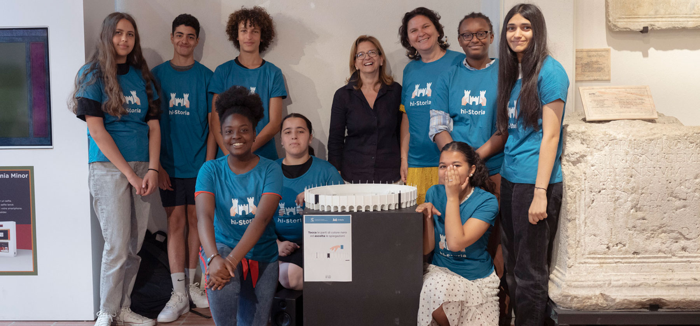

# Hi-Storia Open Source

Hi-Storia develops open-source software and hardware resources for tactile audio guides, cultural heritage education, accessibility, digital fabrication and school-based learning projects.

Our tools help schools, students, museums, educators, makers and local communities design interactive tactile devices: 3D-printed models of monuments and cultural heritage sites connected to audio content through capacitive touch sensors.

## Latest project: Hi-Storia Go

**Hi-Storia Go** is our newest open-source project.

It is a lightweight mobile player designed to reuse old smartphones as tactile interactive audio devices for schools, museums and cultural heritage projects.

The goal is to make tactile audio guides easier to build, cheaper to deploy, and more sustainable by giving a second life to existing mobile devices.

## Main repositories

- **Hi-Storia-Go** — Lightweight mobile player designed to reuse old smartphones as tactile interactive audio devices.
- **Tactile-devices-hi-Storia** — Arduino code and hardware resources for building open-source tactile audio-guide devices.
- **Hi-Storia-Player** — Desktop player for tactile audio guides and interactive cultural heritage devices.
- **hi-Storia-Editor** — Editor tools for creating and managing Hi-Storia audio-guide projects.
- **Code-and-Print** — Educational 3D modeling and coding environment for art, architecture and cultural heritage learning.
- **la-nostra-visione** — Notes and documents about the educational, cultural and open-source vision of Hi-Storia.

## What is Hi-Storia?

## What is Hi-Storia?

Hi-Storia is an educational and cultural heritage project based in Italy, active since 2014.

Over the years, Hi-Storia has helped schools, associations, museums and local communities create around fifty tactile audio-guide devices, mainly in Italy and also through European projects and interventions, including in Nice, France (see https://www.hi-storia.it/nizza/ ).

It combines digital fabrication, 3D printing, open-source software, capacitive electronics, storytelling and accessibility to help students explore, document and share cultural heritage through hands-on service learning activities.

Hi-Storia works at the intersection of cultural heritage education, accessibility, open-source technology and digital craftsmanship: schools do not only use technology, they build public cultural tools together with their communities.

## Related projects

- **Schola Fabra** — An educational software ecosystem for digital fabrication, 3D modeling, cultural heritage, accessibility and open learning.
- **ScholastiCAD** — A local-first 3D modeling environment developed within the Schola Fabra / Hi-Storia ecosystem.

## Official links

- Website: https://www.hi-storia.it
- GitHub organization: https://github.com/hi-Storia
- Schola Fabra: https://www.scholafabra.com
